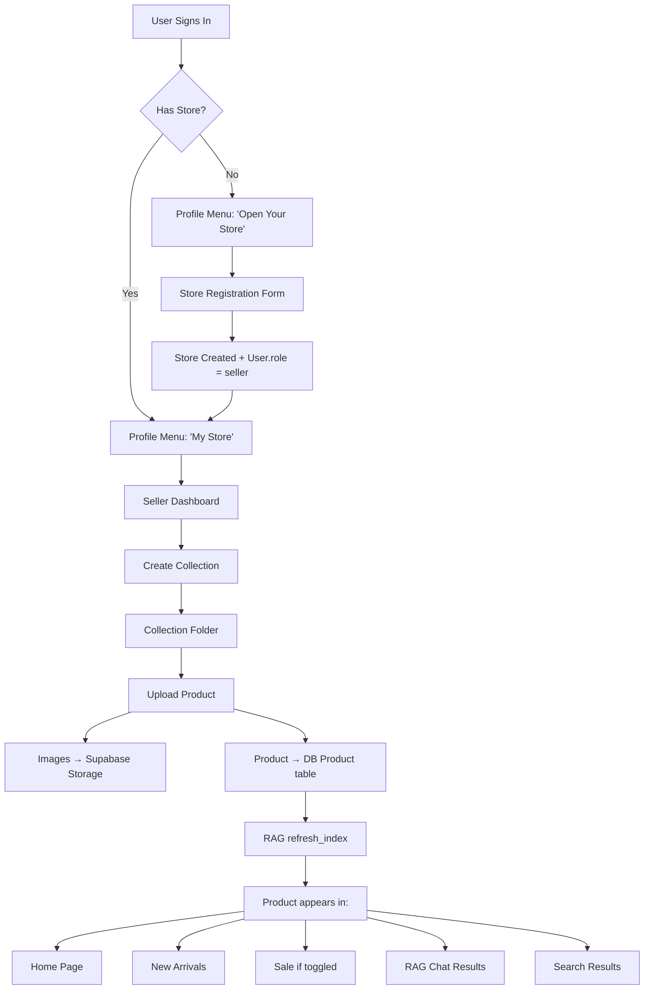
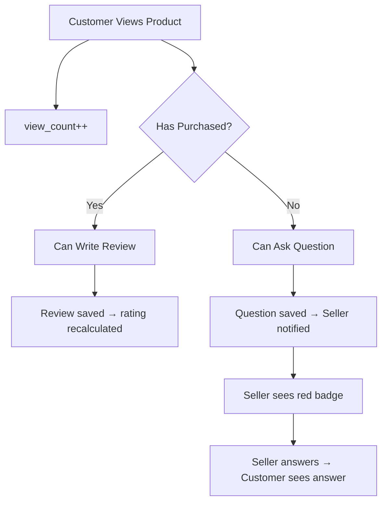

# Seller Store & Product Management System

Full marketplace system allowing authenticated users to register as sellers, create stores, organize products into collections, upload products with images to Supabase, and have them integrate seamlessly with the existing RAG agent, product pages, and customer experience (reviews, Q&A, sale, negotiation).

---

## User Review Required

> [!IMPORTANT]
> **Product table architecture**: Currently there's a single `Product` table for seeded products. Seller-uploaded products will be inserted into this **same `Product` table** (with a `store_id` FK added) so they appear seamlessly across the entire site — home page, new arrivals, sale, search, and RAG results — without any code changes to existing product rendering logic. Seeded products will have `store_id = NULL` (HDwear official inventory).

> [!WARNING]
> **Supabase storage**: Seller product images will be uploaded to the same Supabase bucket (`product-images`) used by seed.py, under a `stores/{store_id}/` prefix. This requires the bucket to allow public read access (it already does based on the seed URLs).

> [!IMPORTANT]
> **Review gating**: Only customers who have purchased a product (have an `OrderItem` for it) can leave a review. This requires querying orders. Non-buyers can still ask questions.

---

## Open Questions

> [!IMPORTANT]
> **Store approval**: Should stores be auto-approved on creation, or do you want a manual admin approval step? **Plan assumes auto-approved** for hackathon speed.

> [!IMPORTANT]
> **Product moderation**: Should seller products go live immediately, or require moderation? **Plan assumes immediate** for hackathon.

> [!IMPORTANT]
> **Description minimum length**: You mentioned 100 words minimum for product description. Want me to enforce this strictly on both frontend and backend, or just as a frontend guideline?

> [!IMPORTANT]
> **Home page "top products" ordering**: You mentioned most searched/viewed/rated/bought. For the hackathon, I'll use a combined score of `(rating * reviews_count) + purchase_count` as a popularity metric. We'll add a `view_count` field to Product for tracking views. Is this approach acceptable?

---

## Proposed Changes

### Database Schema (Prisma)

New tables and modifications to existing tables.

#### [MODIFY] [schema.prisma](file:///d:/Dawood/MY%20DEV%20PROJECTS/Hackathon/GC/p2/backend/prisma/schema.prisma)

Add the following new models and modify existing ones:

**Modified `User` model** — add `store` relation + `role` field:
```diff
 model User {
   ...existing fields...
+  role          String         @default("customer")  // "customer" | "seller"
+  store         Store?
+  reviews       Review[]
+  questions     ProductQuestion[]
 }
```

**Modified `Product` model** — add store FK, sale fields, view tracking, and new relations:
```diff
 model Product {
   ...existing fields...
+  store_id             Int?
+  collection_id        Int?
+  is_on_sale           Boolean        @default(false)
+  sale_percentage       Int            @default(0)
+  is_negotiable        Boolean        @default(true)
+  view_count           Int            @default(0)
+  purchase_count       Int            @default(0)
+  material             String?
+  style                String?          // "casual", "formal", "sporty", "streetwear"
+  occasion             String?          // "daily", "party", "wedding", "sports"
+  size_options         String?          // JSON: ["S","M","L","XL"] or ["38","39",...]
+  store                Store?           @relation(fields: [store_id], references: [id])
+  collection           Collection?      @relation(fields: [collection_id], references: [id])
+  images               ProductImage[]
+  reviews              Review[]
+  questions            ProductQuestion[]
 }
```

**New `Store` model**:
```prisma
model Store {
  id            Int            @id @default(autoincrement())
  owner_id      Int            @unique
  name          String
  address       String
  phone         String
  description   String?
  logo_url      String?
  categories    String[]       // ["Clothing", "Perfumes", "Watches", "Bags", "Shoes", "Accessories"]
  is_active     Boolean        @default(true)
  created_at    DateTime       @default(now())
  updated_at    DateTime       @updatedAt
  owner         User           @relation(fields: [owner_id], references: [id], onDelete: Cascade)
  collections   Collection[]
  products      Product[]
}
```

**New `Collection` model** (folders within a store):
```prisma
model Collection {
  id            Int            @id @default(autoincrement())
  store_id      Int
  name          String         // "Shoes", "Summer Shirts", etc.
  description   String?
  icon          String?        @default("folder") // frontend icon hint
  created_at    DateTime       @default(now())
  updated_at    DateTime       @updatedAt
  store         Store          @relation(fields: [store_id], references: [id], onDelete: Cascade)
  products      Product[]

  @@unique([store_id, name])
}
```

**New `ProductImage` model** (1-5 images per product):
```prisma
model ProductImage {
  id            Int            @id @default(autoincrement())
  product_id    Int
  image_url     String
  is_primary    Boolean        @default(false)
  sort_order    Int            @default(0)
  product       Product        @relation(fields: [product_id], references: [id], onDelete: Cascade)
}
```

**New `Review` model**:
```prisma
model Review {
  id            Int            @id @default(autoincrement())
  product_id    Int
  user_id       Int
  rating        Int            // 1-5
  title         String?
  body          String
  created_at    DateTime       @default(now())
  product       Product        @relation(fields: [product_id], references: [id], onDelete: Cascade)
  user          User           @relation(fields: [user_id], references: [id], onDelete: Cascade)

  @@unique([product_id, user_id])  // one review per user per product
}
```

**New `ProductQuestion` model** (Q&A between customer and seller):
```prisma
model ProductQuestion {
  id            Int            @id @default(autoincrement())
  product_id    Int
  user_id       Int            // the asker
  question      String
  answer        String?        // seller's reply (null = unanswered)
  answered_at   DateTime?
  created_at    DateTime       @default(now())
  product       Product        @relation(fields: [product_id], references: [id], onDelete: Cascade)
  user          User           @relation(fields: [user_id], references: [id], onDelete: Cascade)
}
```

---

### Backend — New Router & Service Files

#### [NEW] [store.py](file:///d:/Dawood/MY%20DEV%20PROJECTS/Hackathon/GC/p2/backend/routers/store.py)

Endpoints:
| Method | Path | Auth | Description |
|--------|------|------|-------------|
| `POST` | `/store/register` | ✅ | Create store (name, address, phone, categories, description) |
| `GET` | `/store/me` | ✅ | Get current user's store |
| `PUT` | `/store/me` | ✅ | Update store info |
| `GET` | `/store/{id}` | ❌ | Public store profile |

#### [NEW] [seller.py](file:///d:/Dawood/MY%20DEV%20PROJECTS/Hackathon/GC/p2/backend/routers/seller.py)

Endpoints for store owners managing their inventory:
| Method | Path | Auth | Description |
|--------|------|------|-------------|
| `POST` | `/seller/collections` | ✅ Seller | Create collection |
| `GET` | `/seller/collections` | ✅ Seller | List my collections |
| `DELETE` | `/seller/collections/{id}` | ✅ Seller | Delete collection |
| `POST` | `/seller/products` | ✅ Seller | Upload product (multipart with images) |
| `PUT` | `/seller/products/{id}` | ✅ Seller | Update product |
| `DELETE` | `/seller/products/{id}` | ✅ Seller | Delete product |
| `PUT` | `/seller/products/{id}/sale` | ✅ Seller | Toggle sale + set percentage |
| `GET` | `/seller/products` | ✅ Seller | List my products |
| `GET` | `/seller/notifications` | ✅ Seller | Get unanswered questions count + list |
| `PUT` | `/seller/questions/{id}/answer` | ✅ Seller | Answer a product question |

#### [NEW] [reviews.py](file:///d:/Dawood/MY%20DEV%20PROJECTS/Hackathon/GC/p2/backend/routers/reviews.py)

| Method | Path | Auth | Description |
|--------|------|------|-------------|
| `POST` | `/products/{id}/reviews` | ✅ (must have purchased) | Post review |
| `GET` | `/products/{id}/reviews` | ❌ | List reviews for a product |
| `POST` | `/products/{id}/questions` | ✅ | Ask a question |
| `GET` | `/products/{id}/questions` | ❌ | List Q&A for a product |

#### [NEW] [store_service.py](file:///d:/Dawood/MY%20DEV%20PROJECTS/Hackathon/GC/p2/backend/services/store_service.py)

Business logic for store registration, collection CRUD, product upload (with Supabase Storage upload via `httpx`), image management.

Key function: **`upload_product_images()`** — uploads to Supabase Storage at path `stores/{store_id}/{product_id}/{filename}` and returns public URLs, same pattern as seed.py.

#### [NEW] [review_service.py](file:///d:/Dawood/MY%20DEV%20PROJECTS/Hackathon/GC/p2/backend/services/review_service.py)

Business logic for reviews (with purchase verification) and Q&A.

---

#### [MODIFY] [main.py](file:///d:/Dawood/MY%20DEV%20PROJECTS/Hackathon/GC/p2/backend/main.py)

Register the 3 new routers:
```diff
 from routers import products, orders, chat, auth, cart
+from routers import store, seller, reviews
 ...
+app.include_router(store.router)
+app.include_router(seller.router)
+app.include_router(reviews.router)
```

#### [MODIFY] [schemas.py](file:///d:/Dawood/MY%20DEV%20PROJECTS/Hackathon/GC/p2/backend/models/schemas.py)

Add Pydantic models:
- `StoreRegisterRequest` (name, address, phone, categories[], description?)
- `StoreResponse`
- `CollectionCreate` / `CollectionResponse`
- `SellerProductCreate` (name, description ≥100 words, price, min_price, category, sub_category, color, gender, season, material?, style?, occasion?, size_options?, is_negotiable, collection_id)
- `ProductSaleToggle` (is_on_sale, sale_percentage)
- `ReviewCreate` (rating, title?, body)
- `ReviewResponse`
- `QuestionCreate` / `QuestionResponse`
- `AnswerRequest`

#### [MODIFY] [product_service.py](file:///d:/Dawood/MY%20DEV%20PROJECTS/Hackathon/GC/p2/backend/services/product_service.py)

- Add `get_product_by_id()` for use in the product detail endpoint and review verification
- Add `increment_view_count()` for tracking product views
- Add `get_popular_products()` that orders by `(rating * reviews_count + purchase_count)` descending

#### [MODIFY] [order_service.py](file:///d:/Dawood/MY%20DEV%20PROJECTS/Hackathon/GC/p2/backend/services/order_service.py)

After order placement, increment `purchase_count` on each product.

#### [MODIFY] [rag_service.py](file:///d:/Dawood/MY%20DEV%20PROJECTS/Hackathon/GC/p2/backend/services/rag_service.py)

- `_product_to_document()` — include new fields: `material`, `style`, `occasion`, `store_name` (via join/lookup), `is_on_sale`, `sale_percentage` so the RAG can recommend sale items and search by material/style/occasion
- `_parse_query_intent()` — add intent detection for:
  - "on sale" / "discounted" → filter `is_on_sale = True`
  - Material keywords (leather, cotton, denim, etc.)
  - Style keywords (casual, formal, sporty)
  - Occasion keywords (daily, party, wedding)
  - Store/category keywords ("watch stores", "perfume stores")
- `_matches_filters()` — add sale filter matching
- After product upload/update/delete by seller → call `refresh_index()` to re-embed

#### [MODIFY] [chat_service.py](file:///d:/Dawood/MY%20DEV%20PROJECTS/Hackathon/GC/p2/backend/services/chat_service.py)

- Update system prompt to tell The Clerk about sale items, store names, and new product attributes
- Add inventory text line to include sale badge and store name

---

### Backend — Config Updates

#### [MODIFY] [config.py](file:///d:/Dawood/MY%20DEV%20PROJECTS/Hackathon/GC/p2/backend/core/config.py)

```diff
+SUPABASE_URL: str = os.getenv("SUPABASE_URL", "")
+SUPABASE_SERVICE_KEY: str = os.getenv("SUPABASE_SERVICE_KEY", "")
+SUPABASE_BUCKET: str = "product-images"
```

#### [MODIFY] [.env](file:///d:/Dawood/MY%20DEV%20PROJECTS/Hackathon/GC/p2/backend/.env)

```diff
+SUPABASE_URL=https://zznakrbijfaxzfoatdzs.supabase.co
+SUPABASE_SERVICE_KEY=<your-service-role-key>
```

> [!IMPORTANT]
> You'll need to provide your Supabase service role key for server-side image uploads. The anon key won't work for storage writes.

---

### Frontend — New Pages & Components

#### [NEW] `frontend/app/seller/register/page.tsx`
Store registration form:
- Store name (required)
- Store address (required)
- Phone number (required)
- Description (optional)
- Category multi-select checkboxes: Clothing, Perfumes, Watches, Bags, Shoes, Accessories, Jewelry, Electronics
- Premium UI with the same design language as auth pages

#### [NEW] `frontend/app/seller/dashboard/page.tsx`
Seller dashboard — the main hub after store registration:
- Store info card at top
- Grid of collection folders (with folder-style icons)
- "Create Collection" button
- Notification bell with red badge for unanswered questions
- Quick stats: total products, total views, total sales

#### [NEW] `frontend/app/seller/collections/[id]/page.tsx`
Inside a collection — shows products within that collection:
- "Upload Product" button
- Product grid with edit/delete/sale-toggle actions
- Back navigation to dashboard

#### [NEW] `frontend/app/seller/products/upload/page.tsx`
Product upload form:
- Image upload (1-5 images, drag & drop + gallery select)
- Product name (required)
- Description (required, 100+ words with live word counter)
- Price (max/display price — required)
- Min negotiable price (required)
- Is negotiable toggle
- Category dropdown
- Sub-category dropdown
- Color input
- Gender: Male / Female / Unisex (required radio)
- Season: Summer / Winter / All Season (required)
- Material (optional: leather, cotton, denim, silk, polyester, etc.)
- Style (optional: casual, formal, sporty, streetwear)
- Occasion (optional: daily, party, wedding, sports)
- Size options (multi-select chips: S, M, L, XL, XXL for clothes; 38-46 for shoes)
- Collection selector (which collection to put it in)
- Submit → uploads images to Supabase → creates product in DB → triggers RAG refresh

#### [MODIFY] [Navbar.tsx](file:///d:/Dawood/MY%20DEV%20PROJECTS/Hackathon/GC/p2/frontend/components/Navbar.tsx)

In the profile dropdown (authenticated state), add:
```diff
 {isAuthenticated ? (
   <>
     <div className="px-4 py-3 border-b border-slate-100 bg-slate-50">
       <p className="font-bold text-sm">{user?.name}</p>
       <p className="text-[10px] text-slate-400">{user?.email}</p>
     </div>
+    {user?.role === "seller" && user?.store ? (
+      <Link href="/seller/dashboard">
+        <Store size={16} /> My Store
+      </Link>
+    ) : (
+      <Link href="/seller/register">
+        <StorePlus size={16} /> Open Your Store
+      </Link>
+    )}
     <button onClick={handleLogout}>
       <LogOut size={16} /> Log Out
     </button>
   </>
 )}
```

#### [MODIFY] [page.tsx (collections/[id])](file:///d:/Dawood/MY%20DEV%20PROJECTS/Hackathon/GC/p2/frontend/app/collections/%5Bid%5D/page.tsx)

Add below the existing product detail:
1. **Image gallery** — if product has `images[]`, render a carousel/thumbnails. Falls back to `image_url` for seeded products.
2. **Sale badge** — if `is_on_sale`, show discount badge and strikethrough price
3. **Reviews section** — fetch and display reviews, star distribution
4. **"Write Review" button** — only visible if user has purchased the product (check via API)
5. **Q&A section** — "Ask the Seller" form and listed questions/answers
6. **Store info card** — if product has a store, show store name, link to store page
7. **Track view** — on mount, call `POST /products/{id}/view` to increment `view_count`

#### [MODIFY] [page.tsx (home)](file:///d:/Dawood/MY%20DEV%20PROJECTS/Hackathon/GC/p2/frontend/app/page.tsx)

- Fetch products sorted by popularity (new endpoint) for the main collection grid
- Products with sale badges render their discount overlay automatically

#### [MODIFY] [page.tsx (sale)](file:///d:/Dawood/MY%20DEV%20PROJECTS/Hackathon/GC/p2/frontend/app/sale/page.tsx)

- Replace hardcoded sale filter with real `is_on_sale === true` filter
- Display actual `sale_percentage` from database

#### [MODIFY] [page.tsx (new-arrivals)](file:///d:/Dawood/MY%20DEV%20PROJECTS/Hackathon/GC/p2/frontend/app/new-arrivals/page.tsx)

- Seller products appear here seamlessly (they're in the same Product table, sorted by `created_at DESC`)

#### [MODIFY] [ProductCard.tsx](file:///d:/Dawood/MY%20DEV%20PROJECTS/Hackathon/GC/p2/frontend/components/ProductCard.tsx)

- Add sale badge overlay when `product.is_on_sale` is true
- Show strikethrough original price + discounted price

#### [MODIFY] [types/index.ts](file:///d:/Dawood/MY%20DEV%20PROJECTS/Hackathon/GC/p2/frontend/types/index.ts)

Add new types:
```typescript
export interface Store { id, name, address, phone, categories, description, logo_url, is_active }
export interface Collection { id, store_id, name, description, icon }
export interface ProductImage { id, image_url, is_primary, sort_order }
export interface Review { id, rating, title, body, user_name, created_at }
export interface ProductQuestion { id, question, answer, user_name, answered_at, created_at }

// Extend User
export interface User {
  ...existing...
  role?: "customer" | "seller";
  store?: Store;
}

// Extend Product
export interface Product {
  ...existing...
  store_id?: number;
  collection_id?: number;
  is_on_sale?: boolean;
  sale_percentage?: number;
  is_negotiable?: boolean;
  images?: ProductImage[];
  store_name?: string;
  material?: string;
  style?: string;
  occasion?: string;
}
```

#### [MODIFY] [api.ts](file:///d:/Dawood/MY%20DEV%20PROJECTS/Hackathon/GC/p2/frontend/lib/api.ts)

Add API functions:
```typescript
// Store
registerStore(data): Promise<Store>
getMyStore(): Promise<Store>
getStore(id): Promise<Store>

// Collections  
createCollection(name, description?): Promise<Collection>
getMyCollections(): Promise<Collection[]>
deleteCollection(id): Promise<void>

// Seller Products
uploadProduct(formData: FormData): Promise<Product>
updateProduct(id, data): Promise<Product>
deleteProduct(id): Promise<void>
toggleProductSale(id, is_on_sale, sale_percentage): Promise<Product>
getMyProducts(collectionId?): Promise<Product[]>

// Reviews & Q&A
getProductReviews(productId): Promise<Review[]>
postReview(productId, data): Promise<Review>
canReview(productId): Promise<boolean>
getProductQuestions(productId): Promise<ProductQuestion[]>
postQuestion(productId, question): Promise<ProductQuestion>
answerQuestion(questionId, answer): Promise<ProductQuestion>
getSellerNotifications(): Promise<{ count, questions[] }>

// View tracking
trackProductView(productId): Promise<void>
```

#### [MODIFY] [StoreContext.tsx](file:///d:/Dawood/MY%20DEV%20PROJECTS/Hackathon/GC/p2/frontend/context/StoreContext.tsx)

- Extend `User` state to include `role` and `store`
- Update `UserResponse` schema to include `role`
- After store registration, update user state with `role: "seller"` and `store` data

---

## Data Flow Summary





---

## Verification Plan

### Automated Tests
```bash
# Run Prisma migration
cd backend && npx prisma migrate dev --name add_store_seller_system

# Generate Prisma client
npx prisma generate

# Start backend and verify health
python -m uvicorn main:app --reload

# Start frontend
cd frontend && npm run dev
```

### Manual Verification
1. **Store Registration Flow**: Sign in → Click "Open Your Store" → Fill form → Verify store created
2. **Collection Creation**: Dashboard → Create "Shoes" collection → Verify folder appears
3. **Product Upload**: Enter collection → Upload product with 3 images → Verify:
   - Product appears on home page
   - Product appears in new arrivals
   - Product page renders with image gallery, description, store info
   - RAG agent can find the product by name, color, gender, style, etc.
4. **Sale Toggle**: Toggle sale on a product → Verify it appears in `/sale` page with correct discount badge
5. **Review System**: Buy a product → Post review → Verify review appears on product page → Verify only buyers can review
6. **Q&A System**: Ask question as customer → Verify seller sees notification → Answer → Verify answer appears
7. **Price Negotiation**: Chat with RAG about a seller product → Verify negotiation uses `min_price` correctly
8. **RAG Integration**: Chat "show me summer shoes" → Verify seller-uploaded summer shoes appear in results alongside seeded products
